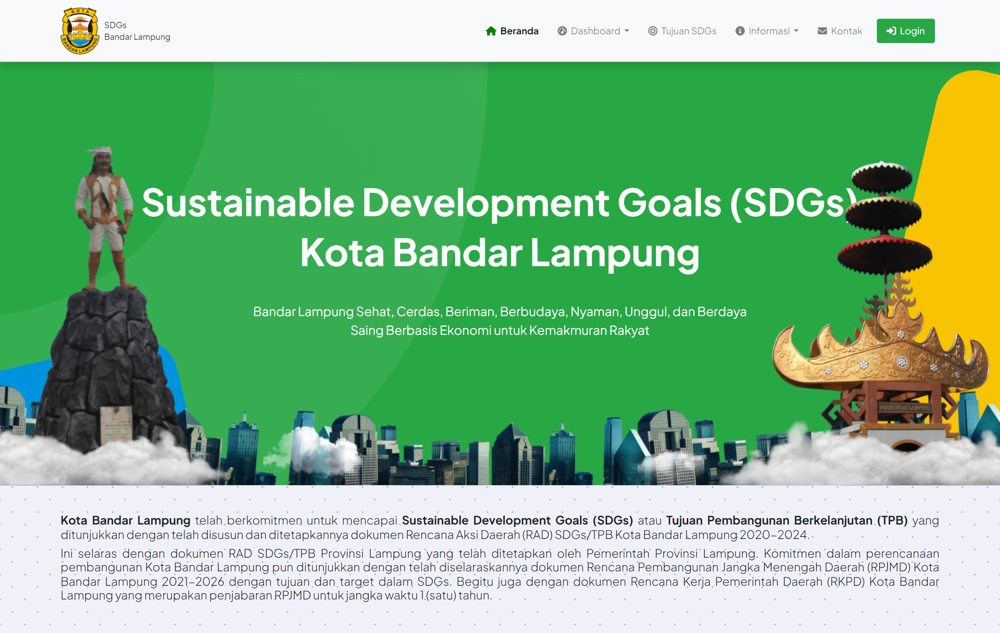

# SGDs Website Bandar Lampung

## About Project

This project involves the development of a website dedicated to the Sustainable Development Goals (SDGs) for the city of Bandar Lampung. The website will be used by various local government organizations in Bandar Lampung to monitor, document, and improve their progress towards achieving the SDGs through comprehensive data management.

## Tech Stack

     

## License

The Laravel framework is open-sourced software licensed under the [MIT license](https://opensource.org/licenses/MIT).
